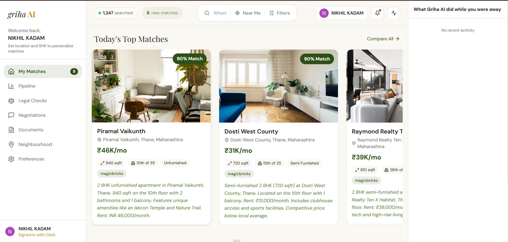
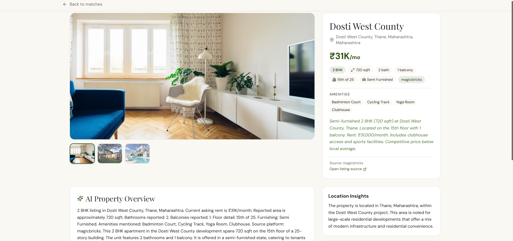
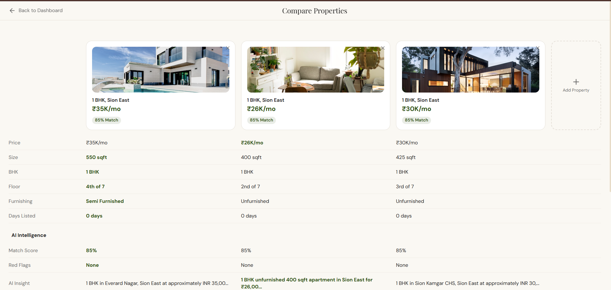
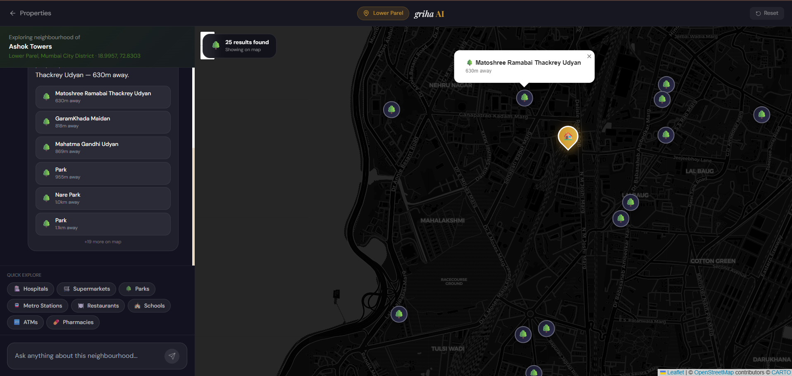
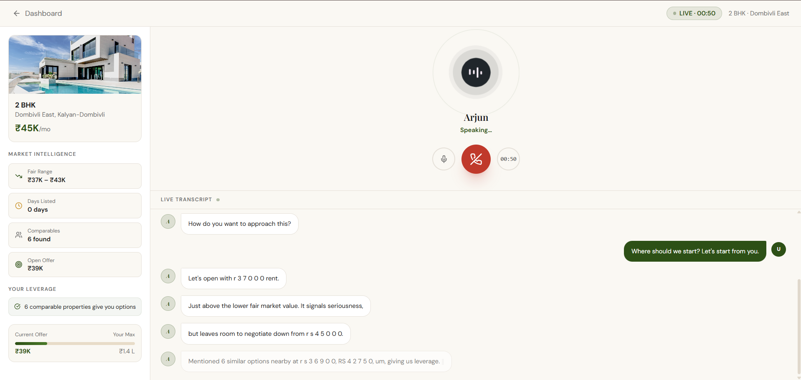
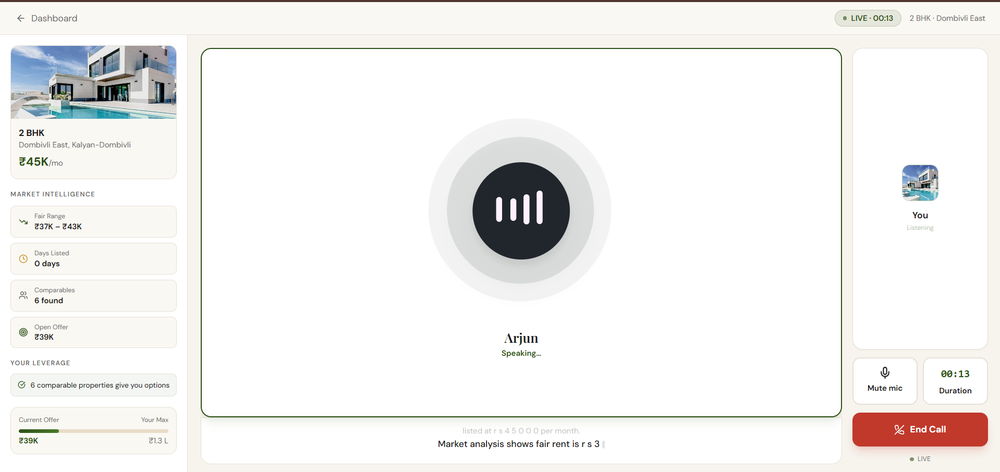
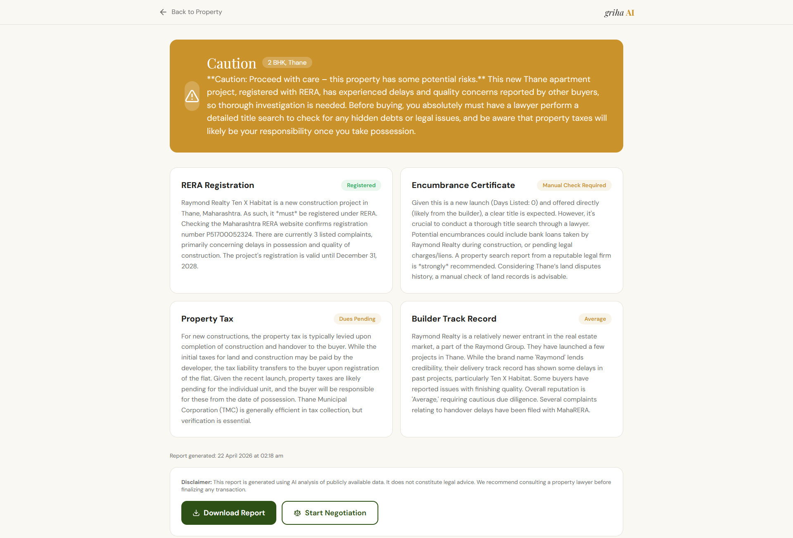

<div align="center">

<br/>


# griha**AI** — Find Your Home. Without the Headache.

**India's first AI-native property platform.**  
Searches listings, verifies legals, negotiates with brokers, reviews contracts, and now watches prices — so you just make the final call.

<br/>

[](https://nextjs.org)
[](https://fastapi.tiangolo.com)
[](https://www.mongodb.com/atlas)
[](https://deepmind.google/technologies/gemini/)
[](https://clerk.com)
[](https://vapi.ai)

<br/>

</div>

---

## ✨ What is Griha AI?

Finding a home in India means fighting through **fake listings**, **opaque broker fees**, **dodgy legal documents**, and endless negotiation mind-games. Griha AI replaces the entire painful pipeline with a fleet of specialized AI agents that work 24/7 on your behalf.

> *"12,400+ properties verified · 8,200+ contracts reviewed · 94% of users found a home in under 3 weeks"*

---

## 🖼️ Screenshots

### 🏠 Landing Page


---

### 📊 AI Dashboard — Smart Property Matches

Your personalized feed of AI-matched properties with match scores, live scraping, and pipeline tracking.



---

### 🏡 Property Detail — Deep AI Analysis

Every property gets a full AI breakdown: overview, location insights, investment signals, watch-outs, and negotiation tips.



---

### ⚖️ Side-by-Side Property Comparison

Compare up to 4 properties across 15+ data points with AI intelligence highlighted for the best value pick.



---

### 🗺️ Neighbourhood Intelligence — Dark Map Explorer

Interactive map view with nearby parks, metro stations, hospitals, supermarkets, schools, and more — powered by OpenStreetMap.



---

### 🎙️ Voice Negotiation — AI Broker "Arjun" (Live Call)

Talk to Arjun, your AI property broker, in real time via voice call. He knows the market data, your budget, and your leverage — and negotiates accordingly.





---

### 🛡️ Legal Intelligence Report

AI-powered RERA verification, encumbrance status, property tax analysis, and builder track record — with a Clean / Caution / High Risk verdict.



---

## 🚀 Features

| Feature | Description |
|---------|-------------|
| 🔍 **Live Property Scraping** | Scrapes MagicBricks, 99acres, Housing.com & NoBroker on demand with real-time progress |
| 🤖 **AI Match Scoring** | Every property scored 0–100% against your budget, BHK, location & must-haves |
| 🛡️ **Legal Intelligence** | RERA check, encumbrance, tax status, builder track record — Clean / Caution / High Risk |
| 📄 **Contract AI** | OCR + clause-by-clause risk analysis of rent agreements with plain-English explanations |
| 🎙️ **Voice Negotiation** | Real-time AI voice call with "Arjun" who negotiates with brokers using market data |
| 🗺️ **Neighbourhood Intelligence** | Interactive map, commute time, AQI, livability score, POI density |
| 🔔 **Price Drop Alerts** | Watch any property; get notified the moment the price hits your target threshold |
| 📊 **Property Pipeline** | Kanban-style board tracking your properties from shortlist → offer made |
| ⚖️ **Side-by-Side Comparison** | Compare up to 4 properties across 15+ data points |
| 📁 **Document Vault** | Upload & AI-analyze any legal document; ask natural language questions about it |
| 🏠 **Smart Browse** | Full property catalogue with BHK, gated, pet-friendly, parking filters |
| 🕵️ **Fake Listing Detection** | AI flags duplicate/bait-and-switch listings with a confidence score |

---

## 🤖 Agent Architecture

Griha AI runs a multi-agent backend where each agent owns a specialized domain:

| Agent | Role |
|-------|------|
| 🔍 **Scraper Agent** | Live property research via Gemini + DuckDuckGo + real estate sites |
| 🧠 **Matching Agent** | Scores every property against your preferences (0–100%) |
| ⚖️ **Legal Agent** | RERA check, encumbrance, tax status, builder track record |
| 📄 **Contract Agent** | OCR + clause-by-clause risk analysis of rental agreements |
| 🎙️ **Negotiation Agent** | Market research → opening offer → counter-offer state machine |
| 🗺️ **Neighbourhood Agent** | Locality reports: commute, amenities, AQI, sentiment, price trends |
| 🔔 **Alert Agent** | Price snapshot tracking with threshold detection & trigger history |

---

## 🛠️ Tech Stack

### Frontend
- **Next.js 14** (App Router) — TypeScript
- **Framer Motion** — micro-animations throughout
- **Lottie React** — animated AI soundwave visualization
- **Clerk** — auth (Google + email)
- **Vapi AI** — real-time voice call SDK
- **Leaflet + OpenStreetMap** — interactive neighbourhood maps

### Backend
- **FastAPI** — async Python API
- **Beanie + MongoDB Atlas** — ODM with reactive queries
- **Google Gemini** — Flash 2.0, Pro, and 1.5 Flash models
- **Twilio** — WhatsApp message delivery for broker contact
- **PyMuPDF + OCR.space** — PDF/image text extraction pipeline

---

## 🚀 Getting Started

### Prerequisites

```
Node.js 20+     (frontend)
Python 3.11+    (backend)
MongoDB Atlas   (connection string)
Gemini API key  (Google AI Studio)
Clerk account   (auth)
```

### Frontend

```bash
cd frontend
npm install
cp .env.example .env.local   # fill in your keys
npm run dev
```

Open [http://localhost:3000](http://localhost:3000)

### Backend

```bash
cd backend
python -m venv venv
venv\Scripts\activate        # Windows
pip install -r requirements.txt
cp .env.example .env         # fill in your keys
uvicorn main:app --reload --port 8000
```

API runs at [http://localhost:8000](http://localhost:8000) · Docs at [/docs](http://localhost:8000/docs)

---

## 🔑 Environment Variables

### Frontend (`.env.local`)

```env
NEXT_PUBLIC_CLERK_PUBLISHABLE_KEY=pk_...
CLERK_SECRET_KEY=sk_...
NEXT_PUBLIC_API_URL=http://localhost:8000
```

### Backend (`.env`)

```env
MONGODB_URL=mongodb+srv://...
GEMINI_API_KEY=AIza...
CLERK_SECRET_KEY=sk_...
OCR_SPACE_API_KEY=...
CLOUDINARY_CLOUD_NAME=...
CLOUDINARY_API_KEY=...
CLOUDINARY_API_SECRET=...
RESEND_API_KEY=re_...
TWILIO_ACCOUNT_SID=AC...
TWILIO_AUTH_TOKEN=...
TWILIO_WHATSAPP_FROM=+14155238886
```

---

## 📁 Project Structure

```
griha_ai/
├── frontend/               # Next.js 14 App Router
│   ├── src/app/
│   │   ├── page.tsx        # Landing page
│   │   ├── dashboard/      # Main property matches + live scraping
│   │   ├── browse/         # Full catalogue with filters
│   │   ├── property/[id]/  # Property detail + full AI analysis
│   │   ├── alerts/         # Price drop alert watchlist
│   │   ├── pipeline/       # Property pipeline (Kanban board)
│   │   ├── negotiate/[id]/ # Voice negotiation (Vapi AI)
│   │   ├── neighbourhood/  # Map + locality intelligence
│   │   ├── compare/        # Side-by-side comparison
│   │   ├── contract/       # Contract analysis + Q&A
│   │   ├── documents/      # Document vault + AI ask
│   │   └── activity/       # Live activity feed
│   └── src/components/
│       └── shared/Navbar   # Sidebar + topbar
│
└── backend/                # FastAPI
    ├── main.py
    ├── api/routes/         # properties, negotiation, legal, documents, alerts, …
    ├── services/
    │   ├── scraper_agent.py
    │   ├── matching_agent.py
    │   ├── legal_agent.py
    │   ├── contract_agent.py
    │   ├── negotiation_agent.py
    │   └── neighbourhood_agent.py
    └── database/models/    # Beanie ODM documents (incl. PriceAlert)
```

---

## 🗺️ Roadmap

- [x] Live property scraping (MagicBricks, 99acres, Housing.com, NoBroker)
- [x] AI match scoring (0–100%)
- [x] Legal intelligence (RERA, encumbrance, tax)
- [x] Contract AI (OCR + clause risk analysis)
- [x] Voice negotiation with AI broker "Arjun"
- [x] Neighbourhood intelligence map
- [x] Property comparison (up to 4 properties)
- [x] Property pipeline (Kanban)
- [x] **Price drop alerts** ← newly shipped
- [x] Document vault with AI Q&A
- [ ] Schedule site visit from property detail
- [ ] Map-based property browsing
- [ ] Mobile responsive layout (in progress)
- [ ] Photo analysis agent (detect water damage, misleading photos)
- [ ] PDF report export (legal, neighbourhood, comparison)

---

## 📄 License

MIT — build freely, attribute kindly.

---

<div align="center">

Built with ♥ for Indian homebuyers who deserve better.

**griha AI** · *गृह* means *home* in Sanskrit

</div>
